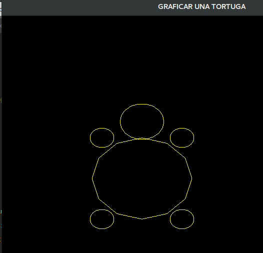
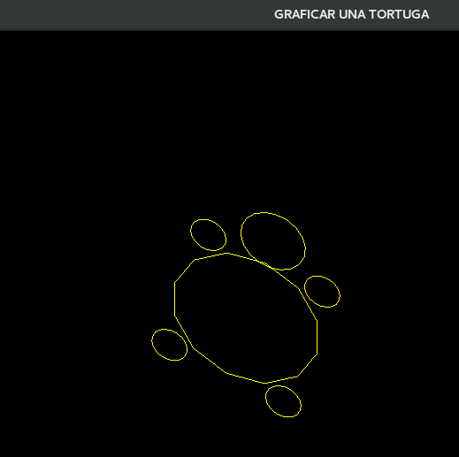
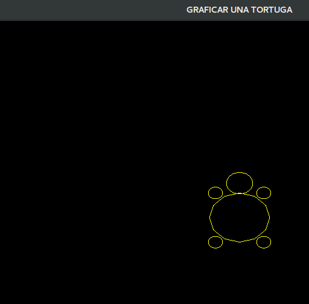

# Computacion-Grafica
Practicas de Computación Grafica Ciencia de la Computación UNSA

Instrucciones

W  Mover arriba  
A  Mover izquierda  
S  Mover abajo  
D  Mover derecha  

I  Rotar arriba  
J  Rotar izquierda  
K  Rotar abajo  
L  Rotar derecha  

'+'  Aumentar escala  
'-'  Disminuir escala  

Practica 2 OpenGL

# Traslacion tortuga

 <!-- .element height="50%" width="50%" -->

# Rotacion tortuga

# Escala Tortuga

