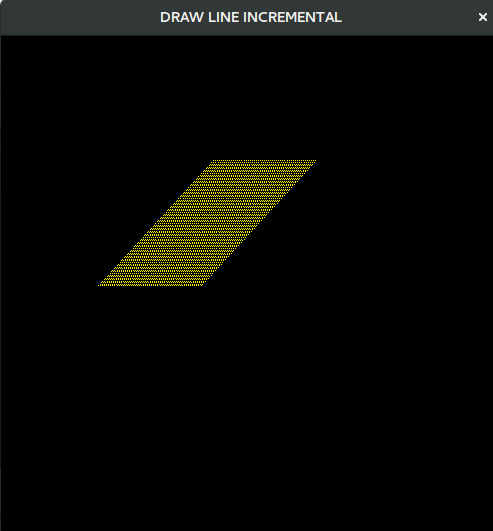
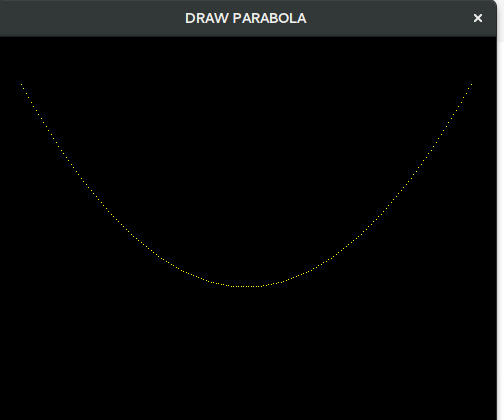

Puntos Extra resolucion de problemas examen1

# Graficar linea en 3d

La idea es iterar un z el cual sera fijo en cada iteracion del calculo de la funcion y= a*x+b

 

# Algoritmo parabola

La idea es evitar volver a calcular el lado negativo por reflexion podemos evitarnos el calculo  
de la funcion y=ax2+bx+c
 
